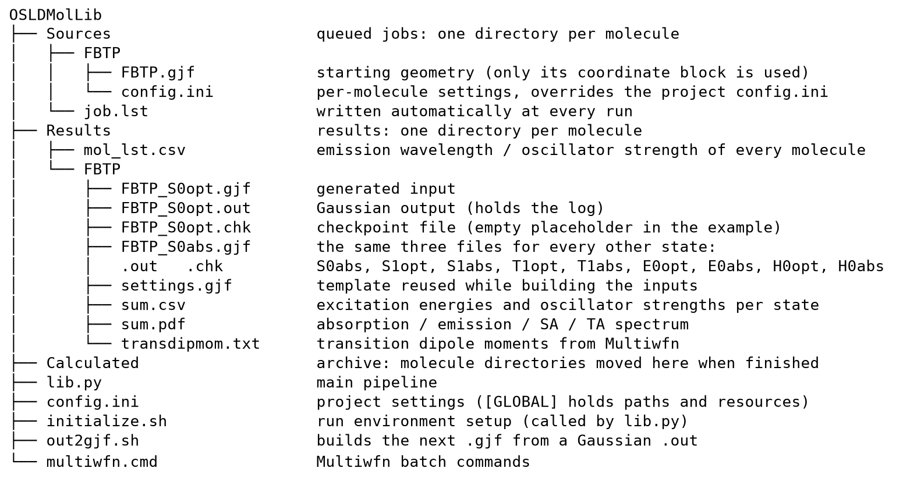

# OSLDMolLib

🇨🇳 **[中文说明 / Chinese version ↓](#中文说明)**

[Purpose and method](#purpose-and-method) · [What it does](#what-it-does) · [Repository layout](#repository-layout) · [Quick start](#quick-start) · [Configuration](#configuration) · [Output files](#output-files) · [Failure handling](#failure-handling) · [Requirements](#requirements) · [Credits](#credits) · [References](#references) · [License](#license)

OSLDMolLib is an automated screening tool for candidate molecules of electrically pumped
organic lasers. It processes a queue of molecules; for each of them it optimises the geometry
of the relevant electronic states (S0, S1, T1, cation and anion), performs the corresponding
vertical absorption calculations, obtains the S1 excited-state absorption with Multiwfn, and
renders the combined spectrum — absorption, emission, polaron absorption (P⁺A / P⁻A),
triplet absorption (TA) and excited-state absorption (SA) — together with the emission
wavelength and the S1 oscillator strength.

The program is designed to run unattended: it keeps processing the queue, and molecules that
are placed in `Sources/` while it is running are appended to the queue automatically.

## Purpose and method

In an electrically pumped organic laser the optical gain has to compete with several loss
channels. The screening therefore requires more than the absorption and emission spectra: the
reabsorption by excitons and by polarons and the accumulation of triplet excitons have to be
assessed as well, and a large oscillator strength of S1 is preferable. The set of
calculations performed here — S0, S1, T1 and the two ionic states, each with its vertical
absorption, plus the transition dipole moments of S1 — is chosen to provide exactly these
quantities.

The computational protocol follows the screen-out strategy proposed by Ou, Peng and Shuai
[1]. For each molecule the program performs the sequence of Gaussian 16 calculations
described below, collects the resulting transition energies and oscillator strengths, and
compiles them into a single spectrum, so that a large number of molecules can be screened
without manual intervention.

## What it does

For each molecule taken from the queue, the following steps are carried out:

1. `<name>_S0opt.gjf` is written from the starting geometry and passed to Gaussian 16;
2. the input of the following stage is generated from the preceding `.out` file with
   `out2gjf.sh` (geometry and route section are reassembled automatically);
3. the five branches listed below are executed in parallel, at most `[GLOBAL].n_para` of them
   at the same time:

   | Stage | Calculation | Charge / spin | Default level |
   |---|---|---|---|
   | `S0opt` | ground-state optimisation | 0 / 1 | B3LYP/6-31G(d) |
   | `S0abs` | vertical absorption from S0 | 0 / 1 | CAM-B3LYP/def2-TZVP, 5 states |
   | `S1opt` → `S1abs` | S1 optimisation, then absorption / emission | 0 / 1 | B3LYP/6-31G(d), then CAM-B3LYP, 50 states |
   | `T1opt` → `T1abs` | T1 optimisation, then absorption | 0 / 3 | B3LYP, then M06-2X |
   | `E0opt` → `E0abs` | anion optimisation, then absorption | −1 / 2 | B3LYP, then CAM-B3LYP |
   | `H0opt` → `H0abs` | cation optimisation, then absorption | +1 / 2 | B3LYP, then CAM-B3LYP |

4. the `Excited State` lines of all absorption runs are collected in `Results/<name>/sum.csv`;
5. `formchk` is applied to `<name>_S1abs.chk` and the resulting `.fchk` file is passed to
   Multiwfn together with `multiwfn.cmd`, which produces `transdipmom.txt` (transition
   dipole moments, from which the S1 excited-state absorption is obtained);
6. all curves are broadened with Gaussian line shapes (`[GRAPH].fwhm`) and saved as
   `sum.pdf`;
7. the emission wavelength and the oscillator strength of the molecule are appended to
   `Results/mol_lst.csv`, and `Sources/<name>/` is moved to `Calculated/`.

Afterwards the next molecule is taken from the queue. If the queue is empty, the message
`All jobs are finished, input new job.` is printed and `Sources/` is inspected again every
60 s.

The stage names correspond to the curves of the spectrum as follows:

| Curve | Origin |
|---|---|
| Abs | `S0abs` |
| Emit | `S1abs`, transition `0->1` |
| TA | `T1abs` |
| P⁻A | `E0abs` (anion) |
| P⁺A | `H0abs` (cation) |
| SA | transition dipole moments of S1 (`transdipmom.txt`) |

## Repository layout



| Path | Contents |
|---|---|
| `lib.py` | the pipeline (entry point) |
| `config.ini` | project settings: `[GLOBAL]` for resources and run environment, one section per stage, `[GRAPH]` for the plot |
| `initialize.sh` | run environment setup, invoked by `lib.py` (may also be executed on its own) |
| `out2gjf.sh` | builds the next `.gjf` from a Gaussian `.out` (LiuYang, 2020; used unmodified) |
| `multiwfn.cmd` | Multiwfn batch commands used for the excited-state absorption |
| `Sources/` | queue: one directory per molecule |
| `Results/` | results: one directory per molecule, plus `mol_lst.csv` |
| `Calculated/` | archive: directories of finished molecules are moved here |
| `docs/tree.png` | the layout image above |

`Sources/FBTP/` and `Results/FBTP/` provide a complete example: the input file, all generated
`.gjf` and `.out` files, `sum.csv`, `sum.pdf` and `transdipmom.txt`. The `.chk` and `.fchk`
files contained in the example are empty placeholders; they are included to document which
file names a complete run produces and do not contain data.

## Quick start

The program requires Linux; see [Requirements](#requirements).

1. Obtain the sources and install the Python dependencies:

   ```bash
   git clone https://github.com/Pb-207/OSLDMolLib.git OSLDMolLib
   cd OSLDMolLib
   pip install numpy matplotlib
   ```

2. Adapt `config.ini` to the local Gaussian installation. At least the following three
   entries of `[GLOBAL]` are relevant:

   ```ini
   g16root = ~                                  # $g16root/g16/bsd/g16.profile must exist
   gauss_scrdir = /media/<user>/scratch         # scratch data; heavy I/O, dedicated fast SSD recommended
   multiwfn_path = ~/Multiwfn
   ```

   as well as the resources of the machine:

   ```ini
   n_cores = 90          # cores available
   max_ram = 720         # memory in GB
   n_para = 3            # number of stages calculated simultaneously
   ```

3. Place a molecule in `Sources/`, that is, a directory containing at least one `.gjf` file
   with the starting geometry:

   ```
   Sources/MolA/MolA.gjf          # only the coordinate block is used (see below)
   Sources/MolA/config.ini        # optional, overrides the project config.ini
   ```

4. Start the program:

   ```bash
   python lib.py
   ```

   The queue is processed in alphabetical order; afterwards the program continues to wait for
   new molecules and is terminated with `Ctrl-C`. Since every molecule is archived into
   `Calculated/` as soon as it is finished, the program may be left running unattended.

5. The results are found in `Results/<name>/sum.pdf` (spectrum), `Results/<name>/sum.csv`
   (excitation energies and oscillator strengths) and `Results/mol_lst.csv` (emission data of
   all molecules). The files provided under `Results/FBTP/` may serve as a reference for the
   expected output.

**Only the coordinate block of the starting `.gjf` is evaluated.** Every line beginning with
a space is read as an atom line; the remaining content (route section, `%chk`, `%mem`, charge
and spin) is ignored, because the program generates its own header. A file exported directly
from GaussView can therefore be used unchanged, as can a plain list of indented atomic
coordinates.

## Configuration

`config.ini` is read first, and `Sources/<name>/config.ini` is then read on top of the project
defaults, so that a molecule-specific file has to contain only those entries that differ from
the project values.

`[GLOBAL]` — resources and run environment (the environment entries are passed on to
`initialize.sh` by `lib.py`):

| Key | Meaning |
|---|---|
| `n_cores`, `max_ram`, `max_disk` | resources of the machine |
| `n_para` | number of stages calculated simultaneously |
| `g16root` | parent directory of `g16/` (must contain `g16/bsd/g16.profile`) |
| `g16_profile`, `source_g16_profile` | full path of the profile, and whether it is sourced |
| `gauss_scrdir` | Gaussian scratch directory, created and made writable automatically. The calculations store their scratch data here and generate a large amount of read and write traffic, so a dedicated high-speed SSD is recommended. |
| `multiwfn_path` | Multiwfn directory; may be left empty if the excited-state absorption is not required |
| `omp_thread_limit`, `omp_stacksize`, `gauss_memdef` | OpenMP and memory defaults |
| `ulimit_stack_unlimited` | whether `ulimit -s unlimited` is executed |
| `tune_cpu`, `cpu_max_freq`, `cpu_governor` | optional CPU frequency setup; requires sudo privileges, failures are reported as warnings only |

One section per stage: `[S0OPT] [S0ABS] [S1OPT] [S1ABS] [T1OPT] [T1ABS] [E0OPT] [E0ABS]
[H0OPT] [H0ABS]`. The optimisation sections contain `enable`, `method` and `basis_set`; the
absorption sections contain `method`, `basis_set` and `n_states`. The absorption of a state
is calculated together with its optimisation, because it starts from the optimised geometry.

`[GRAPH]` — `fwhm` (broadening in nm), `min_wavelen`, `max_wavelen`, `wavelen_step`, the
colours of the six curves and the `dpi` of the plot.

## Output files

```
Results/
├── mol_lst.csv                  Molecule,Emission Wavelength (nm),Oscillator Strength
└── <name>/
    ├── <name>_S0opt.gjf/.out    generated input and Gaussian output (contains the log)
    ├── <name>_S0abs/S1opt/S1abs/T1opt/T1abs/E0opt/E0abs/H0opt/H0abs  (the same three files)
    ├── <name>_S1abs.chk/.fchk   checkpoint file and its formchk conversion for Multiwfn
    ├── settings.gjf             template reused when assembling the inputs
    ├── sum.csv                  Geometry,State,Energy (eV),Wavelength (nm),Oscillator Strength
    ├── sum.pdf                  absorption / emission / P⁺A / P⁻A / TA / SA spectrum
    └── transdipmom.txt          transition dipole moments written by Multiwfn
```

## Failure handling

A stage whose `.out` file does not end with `Normal termination` is regarded as failed. The
results of a failed molecule are retained: the `.out` files remain in `Results/<name>/` (they
contain the Gaussian log that documents the cause of the failure), the failed stage is
recorded as `<stage>,error,,,` in `sum.csv`, the molecule is recorded as
`<name>,error,error` in `mol_lst.csv`, and the source directory is archived into
`Calculated/` as usual. The program then proceeds with the next molecule instead of
terminating.

Two further aspects of the behaviour are relevant:

- if the name of a queued molecule already occurs in `Calculated/`, the program terminates
  with `DuplicateJobError`; the queued directory has to be renamed, or the archived directory
  removed, before the program is restarted;
- a stage whose `.out` file already ends with `Normal termination` is not recalculated, so an
  interrupted run can be restarted directly.

## Requirements

- **Linux.** The five branches are parallelised with `multiprocessing.Pool`; the worker
  processes inherit the data of the current molecule through `fork`.
- **Gaussian 16** (`g16`, `formchk`), available in the environment prepared by
  `initialize.sh`.
- **Multiwfn**, required only for the S1 excited-state absorption.
- **Python 3** with `numpy` and `matplotlib`.
- `bash` and the usual coreutils (`cat`, `sed`, `grep`, `awk`, `paste`, `cut`), used by
  `out2gjf.sh`.

## Credits

`out2gjf.sh` was written by LiuYang (2020) and is used unmodified. The excited-state
absorption and the transition dipole moments are calculated with Multiwfn (Tian Lu).

## References

[1] Q. Ou, Q. Peng, Z. Shuai, *Computational screen-out strategy for electrically pumped
organic laser materials*, Nature Communications **11**, 4485 (2020).
[doi:10.1038/s41467-020-18144-x](https://doi.org/10.1038/s41467-020-18144-x)

## License

Released under the MIT License, see [LICENSE](LICENSE). The third-party files listed under
[Credits](#credits) are used as received and are not covered by this license.

---

<a id="中文说明"></a>

# 中文说明

**↑ [English version](#osldmollib)**

OSLDMolLib 是一款面向电泵浦有机激光候选分子的自动化筛选程序。程序以队列方式处理分子：
对每个分子优化相关电子态（S0、S1、T1、阳离子与阴离子）的几何结构，完成对应的垂直吸收计算，
通过 Multiwfn 获得 S1 的激发态吸收，并将吸收、发射、极化子吸收（P⁺A / P⁻A）、三重态吸收
（TA）与激发态吸收（SA）合并输出为一张光谱图，同时给出该分子的发射波长与 S1 振子强度。

程序按长期运行的方式设计：运行期间置入 `Sources/` 的分子会被自动加入队列。

## 用途与方法

在电泵浦有机激光器中，光学增益必须与若干损耗通道竞争。因此筛选工作不能只依赖吸收与发射光谱，
还须评估激子与极化子的再吸收、三重态激子的积累，并优先选择 S1 振子强度较大的分子。本程序所
执行的这一组计算——S0、S1、T1 与两个离子态各自的垂直吸收，外加 S1 的跃迁偶极矩——正是为了
提供上述物理量。

计算方法遵循 Ou、Peng 与 Shuai 提出的筛选策略 [1]。程序对每个分子自动完成下述 Gaussian 16
计算序列，汇总所得的跃迁能量与振子强度，并整理为一张光谱图，从而无需人工干预即可筛选大量分子。

## 计算内容

对队列中的每个分子，程序依次执行以下步骤：

1. 依据起始几何写出 `<名称>_S0opt.gjf`，提交 Gaussian 16 计算；
2. 用 `out2gjf.sh` 从上一阶段的 `.out` 文件中生成下一阶段的输入（几何结构与路由段自动装配）；
3. 并行执行下列五个分支，同时运行的分支数不超过 `[GLOBAL].n_para`：

   | 阶段 | 计算内容 | 电荷 / 自旋 | 默认方法 |
   |---|---|---|---|
   | `S0opt` | 基态几何优化 | 0 / 1 | B3LYP/6-31G(d) |
   | `S0abs` | 从 S0 出发的垂直吸收 | 0 / 1 | CAM-B3LYP/def2-TZVP，5 个态 |
   | `S1opt` → `S1abs` | S1 几何优化，随后吸收 / 发射 | 0 / 1 | B3LYP/6-31G(d)，再 CAM-B3LYP，50 个态 |
   | `T1opt` → `T1abs` | T1 几何优化，随后吸收 | 0 / 3 | B3LYP，再 M06-2X |
   | `E0opt` → `E0abs` | 阴离子几何优化，随后吸收 | −1 / 2 | B3LYP，再 CAM-B3LYP |
   | `H0opt` → `H0abs` | 阳离子几何优化，随后吸收 | +1 / 2 | B3LYP，再 CAM-B3LYP |

4. 将各吸收计算的 `Excited State` 行汇总至 `Results/<名称>/sum.csv`；
5. 对 `<名称>_S1abs.chk` 执行 `formchk`，将所得 `.fchk` 文件连同 `multiwfn.cmd` 一并交给
   Multiwfn，输出 `transdipmom.txt`（跃迁偶极矩，用于得到 S1 的激发态吸收）；
6. 以高斯线型（`[GRAPH].fwhm`）对全部曲线展宽，保存为 `sum.pdf`；
7. 将该分子的发射波长与振子强度追加至 `Results/mol_lst.csv`，并将 `Sources/<名称>/`
   移动至 `Calculated/`。

随后处理队列中的下一个分子。队列为空时打印 `All jobs are finished, input new job.`，并每
60 秒重新检查一次 `Sources/`。

阶段名称与光谱中各曲线的对应关系如下：

| 曲线 | 来源 |
|---|---|
| Abs | `S0abs` |
| Emit | `S1abs`，跃迁 `0->1` |
| TA | `T1abs` |
| P⁻A | `E0abs`（阴离子） |
| P⁺A | `H0abs`（阳离子） |
| SA | S1 的跃迁偶极矩（`transdipmom.txt`） |

## 仓库结构


| 路径 | 内容 |
|---|---|
| `lib.py` | 流水线主程序（入口） |
| `config.ini` | 项目配置：`[GLOBAL]` 用于资源与运行环境，每个阶段一个段，`[GRAPH]` 用于绘图 |
| `initialize.sh` | 运行环境初始化，由 `lib.py` 调用（也可单独执行） |
| `out2gjf.sh` | 从 Gaussian 的 `.out` 生成下一个 `.gjf`（LiuYang, 2020，原样使用） |
| `multiwfn.cmd` | 激发态吸收所用的 Multiwfn 批处理命令 |
| `Sources/` | 队列：每个分子一个目录 |
| `Results/` | 结果：每个分子一个目录，另有 `mol_lst.csv` |
| `Calculated/` | 归档：已算完的分子目录移动至此 |
| `docs/tree.png` | 上文所示的目录结构图 |

`Sources/FBTP/` 与 `Results/FBTP/` 构成一份完整示例：起始输入、各阶段生成的 `.gjf` 与
`.out`、`sum.csv`、`sum.pdf` 以及 `transdipmom.txt` 均在其中。示例内的 `.chk` 与 `.fchk`
为空占位文件，仅用于说明一次完整运行会产生哪些文件名，其中不含数据。

## 快速开始

程序仅支持 Linux，详见下文「环境要求」一节。

1. 获取源码并安装 Python 依赖：

   ```bash
   git clone https://github.com/Pb-207/OSLDMolLib.git OSLDMolLib
   cd OSLDMolLib
   pip install numpy matplotlib
   ```

2. 修改 `config.ini` 以匹配本机的 Gaussian 安装。至少需要设置 `[GLOBAL]` 中的以下三项：

   ```ini
   g16root = ~                                  # 该目录下须存在 g16/bsd/g16.profile
   gauss_scrdir = /media/<user>/scratch         # 临时数据目录；读写密集，建议单独使用高速 SSD
   multiwfn_path = ~/Multiwfn
   ```

   以及本机资源：

   ```ini
   n_cores = 90          # 可用核数
   max_ram = 720         # 内存（GB）
   n_para = 3            # 同时计算的阶段数
   ```

3. 在 `Sources/` 中放置一个分子，即一个至少含一份起始几何 `.gjf` 文件的目录：

   ```
   Sources/MolA/MolA.gjf          # 仅使用坐标块（见下文说明）
   Sources/MolA/config.ini        # 可选，覆盖项目 config.ini
   ```

4. 启动程序：

   ```bash
   python lib.py
   ```

   队列按字母序处理；处理完毕后程序继续等待新分子，可用 `Ctrl-C` 终止。由于每个分子在算完后
   立即归档至 `Calculated/`，程序可长时间无人值守运行。

5. 结果位于 `Results/<名称>/sum.pdf`（光谱）、`Results/<名称>/sum.csv`（激发能与振子强度）
   以及 `Results/mol_lst.csv`（所有分子的发射数据）。`Results/FBTP/` 中的文件可作为预期输出
   的参照。

**起始 `.gjf` 中只有坐标块会被读取。** 所有以空格开头的行按原子行处理；其余内容（路由段、
`%chk`、`%mem`、电荷与自旋）均被忽略，因为程序会自行生成文件头。因此，GaussView 直接导出的
文件可直接使用，单纯一段缩进的原子坐标同样可以。

## 配置

程序先读取 `config.ini`，再在其基础上读取 `Sources/<名称>/config.ini` 覆盖项目默认值。因此，
分子专属的配置文件只需列出与项目取值不同的条目。

`[GLOBAL]` —— 资源与运行环境（环境项由 `lib.py` 传递给 `initialize.sh`）：

| 键 | 含义 |
|---|---|
| `n_cores`、`max_ram`、`max_disk` | 本机资源 |
| `n_para` | 同时计算的阶段数 |
| `g16root` | `g16/` 的父目录（其下须有 `g16/bsd/g16.profile`） |
| `g16_profile`、`source_g16_profile` | profile 的完整路径，以及是否 source 该文件 |
| `gauss_scrdir` | Gaussian 临时目录，缺失时自动创建并放开写入权限。计算过程会在该目录中存放大量临时数据并产生密集读写，建议单独准备一块高速 SSD。 |
| `multiwfn_path` | Multiwfn 目录；不需要激发态吸收时可留空 |
| `omp_thread_limit`、`omp_stacksize`、`gauss_memdef` | OpenMP 与内存默认值 |
| `ulimit_stack_unlimited` | 是否执行 `ulimit -s unlimited` |
| `tune_cpu`、`cpu_max_freq`、`cpu_governor` | 可选的 CPU 调频设置；需要 sudo 权限，失败仅提示警告 |

每个阶段一个段：`[S0OPT] [S0ABS] [S1OPT] [S1ABS] [T1OPT] [T1ABS] [E0OPT] [E0ABS] [H0OPT]
[H0ABS]`。优化段包含 `enable`、`method`、`basis_set`；吸收段包含 `method`、`basis_set`、
`n_states`。某个态的吸收与其优化一同进行，因为吸收计算以优化后的几何结构为起点。

`[GRAPH]` —— `fwhm`（展宽，单位为 nm）、`min_wavelen`、`max_wavelen`、`wavelen_step`、
六条曲线的颜色以及出图的 `dpi`。

## 输出文件

```
Results/
├── mol_lst.csv                  Molecule,Emission Wavelength (nm),Oscillator Strength
└── <名称>/
    ├── <名称>_S0opt.gjf/.out    生成的输入与 Gaussian 输出（含日志）
    ├── <名称>_S0abs/S1opt/S1abs/T1opt/T1abs/E0opt/E0abs/H0opt/H0abs  （同样三个文件）
    ├── <名称>_S1abs.chk/.fchk   检查点文件，及其供 Multiwfn 使用的 formchk 转换结果
    ├── settings.gjf             装配输入时复用的模板
    ├── sum.csv                  Geometry,State,Energy (eV),Wavelength (nm),Oscillator Strength
    ├── sum.pdf                  吸收 / 发射 / P⁺A / P⁻A / TA / SA 光谱
    └── transdipmom.txt          Multiwfn 输出的跃迁偶极矩
```

## 出错处理

`.out` 文件末行不是 `Normal termination` 的阶段视为失败。失败分子的结果予以保留：`.out`
文件仍留在 `Results/<名称>/` 中（其中包含记录失败原因的 Gaussian 日志），失败的阶段在
`sum.csv` 中记为 `<阶段>,error,,,`，该分子在 `mol_lst.csv` 中记为 `<名称>,error,error`，
源目录仍照常归档至 `Calculated/`。随后程序继续处理下一个分子，而不终止运行。

另有两点行为需注意：

- 若队列中某分子的名称已出现在 `Calculated/` 中，程序将以 `DuplicateJobError` 终止；需先
  重命名队列中的目录，或删除归档中的对应目录，再重新启动程序；
- `.out` 文件末行已为 `Normal termination` 的阶段不会重算，因此中断后可直接重新启动。

## 环境要求

- **Linux**。五个分支通过 `multiprocessing.Pool` 并行；工作进程经由 `fork` 继承当前分子的
  相关信息。
- **Gaussian 16**（`g16`、`formchk`），需可在 `initialize.sh` 所准备的环境中找到。
- **Multiwfn**，仅 S1 激发态吸收需要。
- **Python 3**，依赖 `numpy` 与 `matplotlib`。
- `bash` 及常用 coreutils（`cat`、`sed`、`grep`、`awk`、`paste`、`cut`），`out2gjf.sh`
  会用到。

## 致谢

`out2gjf.sh` 由 LiuYang（2020）编写，原样使用；激发态吸收与跃迁偶极矩由 Multiwfn（Tian Lu）
计算得到。

## 参考文献

[1] Q. Ou, Q. Peng, Z. Shuai, *Computational screen-out strategy for electrically pumped
organic laser materials*, Nature Communications **11**, 4485 (2020).
[doi:10.1038/s41467-020-18144-x](https://doi.org/10.1038/s41467-020-18144-x)

## 许可

本项目以 MIT 许可发布，详见 [LICENSE](LICENSE)。「致谢」一节中列出的第三方文件按原样
使用，不在本许可范围之内。
